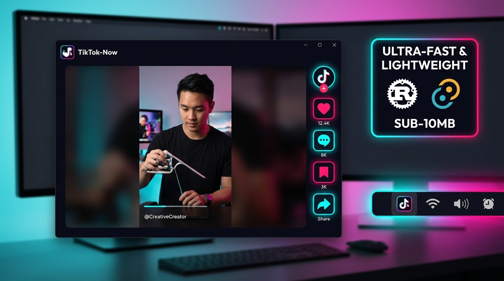

<p align="center">
  <a href="https://github.com/benedictusrey/TikTok-Now">
    
  </a>
</p>

<h1 align="center">TikTok-Now</h1>

<p align="center">
  <strong>A high-performance, ultra-lightweight desktop experience for TikTok</strong><br>
  Built with <code>Tauri v2</code> + <code>Rust</code> + <code>Native WebView</code>
</p>

<p align="center">
  🎉 <strong>TikTok-Now 2.0.0 is now available</strong> 🎉<br>
  Photo posts drag like a native app — and sound works from the very first launch.
</p>

<p align="center">
  <a href="https://github.com/benedictusrey/TikTok-Now/releases/latest"></a>
  <a href="https://github.com/benedictusrey/TikTok-Now/releases/latest"></a>
  <a href="https://tauri.app/"></a>
  <a href="https://www.rust-lang.org/"></a>
  <a href="LICENSE"></a>
  <a href="https://github.com/benedictusrey"></a>
</p>

---

**TikTok-Now** is a tiny desktop app that wraps the official TikTok web experience with the things a desktop app should have had all along: videos that **pause when you leave** and **resume with sound when you return**, photo posts that **swipe like a native app**, keyboard shortcuts, and a quiet home in the system tray. Built with **Tauri v2 + Rust**, it weighs under 10 MB — no Electron, no bundled browser.

> ⚠️ **Disclaimer**: TikTok-Now is an independent, unofficial open-source desktop client by [@benedictusrey](https://github.com/benedictusrey). It is not affiliated with, endorsed by, or maintained by TikTok Ltd. or ByteDance Ltd. TikTok is a registered trademark of its respective owner.

---

## 🧭 Table of Contents

- [✨ What's New in v2.0.0](#-whats-new-in-v200)
- [🛤️ From v1.0.0 to v2.0.0](#️-from-v100-to-v200)
- [🌟 Features & Capabilities](#-what-tiktok-now-adds)
- [⚖️ Web vs TikTok-Now Comparison](#️-tiktok-now-and-the-official-web-experience)
- [⚡ Efficiency & Performance](#-observed-resource-efficiency)
- [📦 Download & Installation](#-download--platform-support)
- [🔒 Security Architecture](#-security--privacy-architecture)
- [📚 Project Documentation](#-documentation)
- [🤝 Community & Contributing](#-contributing--community)
- [👤 Author & License](#-author-and-license)

---

## ✨ What's New in v2.0.0

- 🖼️ **Photo posts finally drag the way they should** — swipe left/right through multi-image posts (the images follow your cursor and snap on release), and **single-photo posts are smart**: dragging never pauses the slideshow and never selects the image. A clean tap still works exactly like TikTok's.
- 🛡️ **No more accidental pauses** — the release click after any drag on a photo post is suppressed, so feed-scrolling that starts on a photo won't pause it either.
- 🎯 **Video posts untouched** — everything from earlier releases (pause on minimize, tray restore, autoplay with sound) keeps working exactly as before.
- 🔉 **Sound on every fresh launch** — cold starts come up unmuted at **50% default volume**. Two layers: a 60-second grace window re-enforces the page's unmute (TikTok re-mutes during its own init), and the watchdog clears the **persisted Windows session mute** that made cold starts silent after a hidden exit (minimize→restore used to be the only way to get sound back).

## 🛤️ From v1.0.0 to v2.0.0

The v1.0.0 initial commit was built for *shipping*, not for *daily scrolling*. Every release since then fixed the things that got in the way:

| Since v1.0.0 | What changed |
|---|---|
| 🔇 **Pause on minimize & close** | Audio stops the instant the window is hidden; resumes where you left off on restore. Backed by a Rust watchdog + OS-level audio-session mute — silence is *guaranteed*. |
| 🖱️ **Tray-icon restore** | Clicking the tray icon always brings the app back to the front as the active window (it used to make the taskbar button vanish). |
- 🔉 **Autoplay with sound** | The first video of a fresh launch plays **unmuted** at **50% volume** (was: always muted until you clicked, or silent until a minimize/restore cycle). |
| 🖼️ **Photo-post drag** | Swipe through carousels; single photos are drag-safe (no pause, no selection). |
| ⌨️ **Shortcuts that work** | `M` mute · `P` picture-in-picture · `S` capture frame · `←`/`→` seek (or flip photo slides) · `A` auto-scroll · `R` refresh. |
| 🚀 **Launch on Startup** | The tray toggle actually enables OS autostart (was a no-op); autostart opens hidden to the tray. |
| 🧩 **Reliable close-to-tray** | Closing always parks the app in the tray (paused) — never quits by accident. |
| 📋 **Dead entries revived** | Capture Video Frame & Copy Video Link now work. |
| ⚡ **Leaner & faster** | 9 unused dependencies removed; smaller binary, faster builds. |
| 📦 **Real publishing** | GitHub Actions builds & publishes Windows, macOS (universal), and Linux assets. |

*Full detail in [CHANGELOG.md](CHANGELOG.md) and [RELEASE_NOTES.md](RELEASE_NOTES.md).*

---

## 🌟 What TikTok-Now adds

<p align="center">
  <br>
  <em>Figure 1: Concept artwork illustrating TikTok-Now's desktop productivity suite — featuring quick feed switching (For You, Following, Friends, Live, Explore), smart autoplay video pausing, system tray integration, and isolated OAuth sign-in.</em>
</p>

<br>

<p align="center">
  <br>
  <em>Figure 2: Product showcase demonstrating TikTok-Now's dark-mode viewing canvas, seamless integration with official TikTok video controls (like, comment, bookmark, share), background system tray behavior, and sub-10 MB binary size built on native Rust + Tauri v2 architecture.</em>
</p>

<br>

| Area | TikTok-Now 2.0.0 Capabilities |
|---|---|
| **Feeds Navigation** | Submenu tray shortcuts for **🔥 For You**, **👥 Following**, **🤝 Friends**, **🔍 Explore**, **🔴 Live**, and **➕ Upload** |
| **Autoplay Engine** | Smart `IntersectionObserver` video engine autoplays focused videos (with sound) and immediately pauses off-screen content to conserve CPU & memory |
| **Photo Post Drag** | Drag horizontally on photo posts: multi-image = flip slides (left = next, right = previous, with cursor-follow feedback); single-photo = drag-safe (no pause, no selection); `←`/`→` keys work too |
| **Pause on Minimize** | Minimizing or closing the window instantly pauses the playing clip — no background audio; restoring the window resumes exactly where you left off (backed by a Rust watchdog + OS-level audio-session mute) |
| **Tray Restore** | Clicking the tray icon while minimized/hidden restores the app to the front as the active window — never loses its taskbar button |
| **OAuth Sign-In** | Clean, isolated popup engine for third-party sign-in options; automatically closes upon successful authentication |
| **System Tray** | Native system tray integration with background minimize-to-tray, single-click toggle, feed switcher, and playback controls |
| **Playback Control** | Play/Pause, Next/Previous video, Rewind/Fast-Forward 5s, Mute, Volume adjust, Like video, Fullscreen, and Picture-in-Picture |
| **Auto-Scroll Mode** | Toggleable continuous scrolling mode automatically advancing to the next clip upon video end |
| **Window Geometry** | Perfectly proportioned **1250 × 900** default window, pre-centered on display launch |
| **Clean Desktop CSS** | Injected styles stripping intrusive mobile app download prompts (*"Get App"*, *"Open App"*) for distraction-free viewing |

---

## ⚖️ TikTok-Now and the official web experience

| Feature | TikTok-Now | Standard Web Browser |
|---|---|---|
| **Maintainer** | Independent project by [@benedictusrey](https://github.com/benedictusrey) | Third-party browsers (Chrome, Edge, Safari) |
| **Service Used** | Official TikTok (`https://www.tiktok.com/`) | Official TikTok (`https://www.tiktok.com/`) |
| **Footprint** | Sub-10 MB native binary; zero bundled Chromium | 200 MB–500 MB+ browser process trees |
| **Tray Behavior** | Native tray icon with full background toggle & feed menu | None (closing window terminates session) |
| **OAuth Cleanup** | Automatic popup intercept & auto-closing login window | Manual popup closing required |
| **Distraction Removal** | Automatic CSS removal of mobile download popups | Stock web banners present |
| **Updates** | GitHub Releases | Browser updates |

---

## ⚡ Observed resource efficiency

Unlike traditional Electron-based desktop wrappers that bundle full Chromium instances (consuming 300MB–800MB RAM), **TikTok-Now** leverages **Tauri v2** and **Rust** to render via the native operating system web engine (WebView2 on Windows, WebKit on macOS/Linux).

- **Binary Size**: Sub-10 MB standalone executable.
- **Resource Management**: The built-in `IntersectionObserver` constantly monitors off-screen DOM nodes and pauses background video streams, preventing memory bloat during extended scrolling sessions.
- **Background Mode**: Minimizing to the system tray lowers window graphics overhead while keeping your feed state instant and responsive.

---

## 📦 Download & Platform Support

Download pre-built release binaries from the [latest GitHub Release](https://github.com/benedictusrey/TikTok-Now/releases/latest).

| Platform | Recommended Asset | Notes |
|---|---|---|
| **🪟 Windows (x86_64)** | `TikTok-Now_v2.0.0_windows-x86_64.exe` | Portable standalone binary. No installation required. |
| **🍎 macOS (Universal)** | `TikTok-Now_v2.0.0_macos-universal` | Combined binary for Apple Silicon (M1/M2/M3/M4) & Intel Macs. |
| **🐧 Linux (x86_64)** | `TikTok-Now_v2.0.0_linux-x86_64` | Native Linux executable targeting GTK3 & WebKit2GTK 4.1. |

### Quick Execution
- **Windows**: Double-click `TikTok-Now_v2.0.0_windows-x86_64.exe`.
- **macOS**:
  ```bash
  chmod +x TikTok-Now_v2.0.0_macos-universal
  ./TikTok-Now_v2.0.0_macos-universal
  ```
- **Linux**:
  ```bash
  chmod +x TikTok-Now_v2.0.0_linux-x86_64
  ./TikTok-Now_v2.0.0_linux-x86_64
  ```

---

## 🔒 Security & Privacy Architecture

TikTok-Now is engineered with security and data privacy as core architectural tenets:

- **Direct First-Party Communication**: All HTTPS connections are established directly between your local device and official TikTok servers (`https://www.tiktok.com/`). TikTok-Now uses zero telemetry, zero analytics trackers, and zero project-operated proxy servers.
- **Native OS Storage Isolation**: Account session cookies, local storage, and session tokens remain strictly contained within your operating system's default webview sandbox:
  - **Windows**: `%LOCALAPPDATA%\com.tiktoknow.desktop\EBWebView`
  - **macOS**: `~/Library/Application Support/com.tiktoknow.desktop`
  - **Linux**: `~/.config/com.tiktoknow.desktop`
- **Isolated OAuth Login Popup Handling**: Third-party login modals (Google, Apple, TikTok QR) run inside an isolated secondary window instance that self-destructs upon login completion, preventing cookie leaks.
- **Cryptographic Verification**: Every release asset attached to [GitHub Releases](https://github.com/benedictusrey/TikTok-Now/releases) is published alongside a verified SHA-256 `checksums.txt` file.

---

## 📚 Documentation

- 📋 [Release Notes](RELEASE_NOTES.md) — Summary of features & assets in current release.
- 📜 [Changelog](CHANGELOG.md) — Complete chronological history of additions & fixes.
- 🤝 [Contributing Guidelines](CONTRIBUTING.md) — How to set up locally, build, and submit PRs.
- 🛡️ [Security Policy](SECURITY.md) — Data privacy architecture & vulnerability reporting.
- ⚙️ [GitHub Actions Release Workflow](.github/workflows/release.yml) — Multi-platform cloud build pipeline.

---

## 🤝 Contributing & Community

Contributions, feature requests, and bug reports are warmly welcomed!

- 🐛 **Found a bug?** Open an issue on [GitHub Issues](https://github.com/benedictusrey/TikTok-Now/issues).
- 💡 **Have an idea?** Share your feedback or suggest features.
- 🛠️ **Want to code?** Read our [Contributing Guide](CONTRIBUTING.md) to get started building locally.
- ⭐ **Like the project?** Give **TikTok-Now** a star on GitHub to show your support!

---

## 👤 Author and license

TikTok-Now is authored and maintained with ❤️ by **[@benedictusrey](https://github.com/benedictusrey)**.

Copyright © 2026 [@benedictusrey](https://github.com/benedictusrey).  
Released under the [MIT License](LICENSE).
